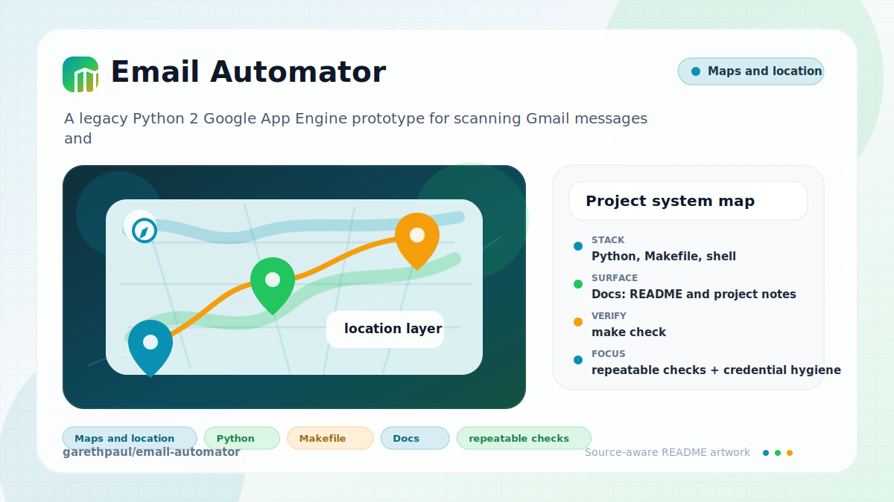

# email-automator

<!-- README-OVERVIEW-IMAGE -->


## Overview

`garethpaul/email-automator` is a legacy Python 2 Google App Engine prototype
for scanning Gmail messages and generating automated replies from local rules.
The live app paths require App Engine services and OAuth credentials; the
default repository verification path only exercises offline rule behavior.

## Repository Contents

- `README.md` - project overview and local usage notes
- `requirements.txt` - legacy Python dependency pins
- `app.yaml` and `cron.yaml` - App Engine routing and scheduled check config
- `database/` - App Engine credential model helpers
- `mail/` - Gmail auth, listing, send, and reply-rule modules
- `main.py` - App Engine webapp route registration
- `SECURITY.md` - security reporting and disclosure guidance
- `VISION.md` - project direction and maintenance guardrails

## Getting Started

### Prerequisites

- Git
- Google App Engine Python 2 SDK for the deployed prototype
- Python 3 for the offline rule tests

### Setup

```bash
git clone https://github.com/garethpaul/email-automator.git
cd email-automator
python -m pip install -r requirements.txt
```

Live Gmail/App Engine paths require local OAuth client configuration and App
Engine credentials that must not be committed. The default local test path below
does not access Gmail, OAuth, App Engine, or real mailbox data.

The setup commands above are derived from repository files. Legacy mobile, Python, or JavaScript samples may require older SDKs or package versions than a modern workstation uses by default.

## Running or Using the Project

- `main.py` defines the App Engine webapp routes for `/auth`, `/mail/check`,
  `/mail/list`, and `/mail/me`.
- `app.yaml` requires HTTPS for app routes, requires login for auth/mail
  handlers, and restricts `/mail/me` to admin/cron access.
- `cron.yaml` schedules `/mail/me`; the automation user id comes from
  `AUTOMATION_USER_ID` instead of a committed query parameter.
- `mail/rules.py` contains the offline-testable automated reply rule logic.

## Testing and Verification

Run the offline rule tests:

```bash
python3 -m unittest discover -s tests -p "test*.py"
```

Run the full local baseline gate:

```bash
scripts/check-baseline.sh
```

These tests use deterministic fixtures, assert duplicate-message cache behavior,
and do not access Gmail or a real inbox.

When the required SDK or runtime is unavailable, use static checks and source review first, then verify on a machine that has the matching platform toolchain.

## Configuration and Secrets

- The scan found credential-adjacent names. Review configuration paths before running against real accounts.
- Keep OAuth client IDs, OAuth client secrets, App Engine credentials, Gmail
  tokens, and real mailbox samples out of git.
- `GOOGLE_CLIENT_ID`, `GOOGLE_CLIENT_SECRET`, `AUTOMATION_USER_ID`,
  `AUTOMATION_TO_EMAIL`, `AUTOMATION_FROM_EMAIL`, and
  `AUTOMATION_APPROVED_SENDERS` are deployment/local configuration values.
- `APP_DEBUG` defaults off; set `APP_DEBUG=1` only for local debugging.

## Security and Privacy Notes

- Review changes touching authentication or token handling; examples from the scan include mail/auth.py, mail/check.py, mail/list.py, mail/send.py, and 2 more.
- Review changes touching external API calls or credential-adjacent configuration; examples from the scan include mail/auth.py.
- Review changes touching network requests, sockets, or service endpoints; examples from the scan include app.yaml, mail/auth.py, test.py.
- Review changes touching file, media, JSON, XML, CSV, OCR, or data parsing; examples from the scan include mail/check.py, mail/list.py, mail/rules.py, mail/send.py.
- Review changes touching database, model, or persistence code; examples from the scan include database/default.py.
- App Engine routes require HTTPS, `/mail/me` is admin-only for cron, and debug
  output is disabled unless `APP_DEBUG=1` is set for local development.

## Maintenance Notes

- See `SECURITY.md` for vulnerability reporting and safe research guidance.
- See `VISION.md` for project direction and contribution guardrails.
- See `docs/plans/2026-06-08-email-rule-baseline.md` for the current offline
  reply-rule baseline.
- See `docs/plans/2026-06-08-app-engine-safety-baseline.md` for the App Engine
  route and configuration safety baseline.

## Contributing

Keep changes small and tied to the project that is already present in this
repository. For code changes, run `scripts/check-baseline.sh`, avoid committing
credentials or mailbox data, keep vendored dependency updates isolated, and
update this README when setup or verification steps change.
